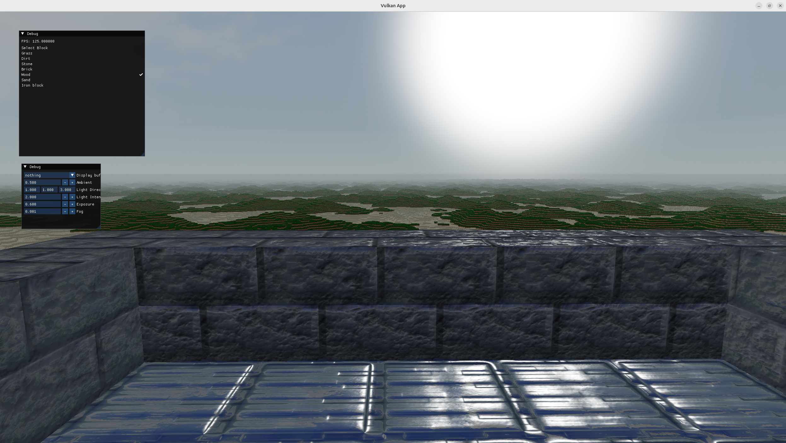

# AABBlocks

AABBlocks is a voxel game which is being developed in Vulkan and C++.

The game focuses in minimal features regarding gameplay, but to implement some rendering techniques that are used in actual games.

## [Video demonstration of an early version](https://www.youtube.com/watch?v=6l75Lxx1cUg)

# Features

## Deferred shading

The game renders the geometry, normals, depth and materials (like color) to a g-buffer instead of directly drawing onto the screen. In a second pass shading is applied. This saves a lot of fragment shaders invocations, which can save time in applications with heavy shader fragments.


## PBR materials and lighting (WIP)


We are currently working on adding support for PBR materials for the project. Right now a Cook-Torrance light model have ben developed in the deferred shader, but it lacks reflections as well as normal mapping. Also support for PBR textures is still barebones despite we're planning to improve it.

PBR texture support turns out to be a little challenging as there is not at standar "PBR" texture format, so they need to be modified in order to handle them in a uniform way.

Regarding lights, only one directional light is currently supported, but it is planned to support point lights in the future. Shadow casting is also not supported yet.
## World persistence

Worlds can be saved onto Sqlite3 databases and then loaded from main menu,
the database contains all the chunks and store it's blocks in a binary format (SQLite blob column type) as well as global map information (like the size of the map).

## ImGUI user interface

The game uses Dear ImGUI for user interface and debug options, allowing to create new worlds, load a previously created world, selecting blocks to build and tweeking graphical and debug options (in order to facilitate development).


## GPU culling and instancing

The engine support GPU culling as well as instancing, both done with a compute shaders which prepare a multi draw indirect drawcall with all visible chunks (chunks that are in the frustum view). This greatly improves performance, altough right now as features are minimal performance is not a real problem.

## Modern Vulkan features

The game uses Vulkan 1.3's dynamic rendering feature to get rid of render passes, as well as bufferDeviceAddress feature for not needing to bind each chunk in a different "draw" function.

# Build

Right now only Linux build is supported, once the proyect is more advanced windows support will be added.

## Linux

You will need CMake, gcc and Vulkan SDK installed in your device, the rest of the dependecies are self-contained or downloaded during build process.

Clone this git repository and inside it open a terminal, type:

```
mkdir build && cd build
cmake ..
cmake --build .
cd src
./AABlocks
```