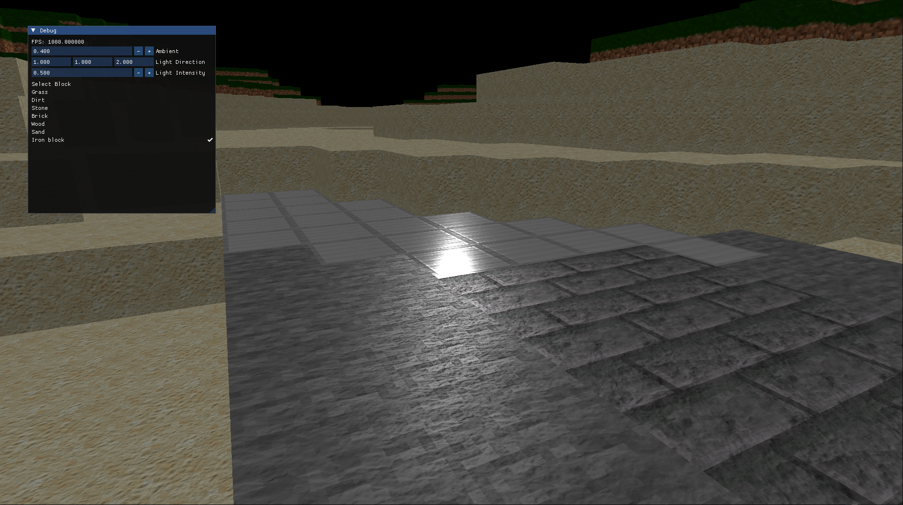

# AABBlocks

AABBlocks is a voxel game currently being developed in Vulkan and C++.  
The project focuses on minimal gameplay features, but aims to implement modern rendering techniques found in contemporary games.

## [Video demonstration of an early version](https://www.youtube.com/watch?v=L_QHcuafhk8)

# Features

## Deferred Shading

The game renders geometry, normals, depth, and material properties (such as color) to a G-buffer instead of drawing directly to the screen. In a second pass, shading is applied. This approach reduces the number of fragment shader invocations, which is beneficial for applications with complex fragment shaders.


## PBR Materials and Lighting (WIP)



Support for PBR materials is currently in development. The deferred shader implements a Cook-Torrance lighting model, but currently lacks reflections and normal mapping. PBR texture support is still basic, and improvements are planned.

Supporting PBR textures is challenging due to the lack of a standard "PBR" texture format, so textures need to be adapted for uniform handling.

Currently, only a single directional light is supported. Point lights and shadow casting are planned for future updates.

## Reflections


Currently, an skybox is being used for calculating reflections, integrated in the pbr shader.

## World Persistence

Worlds can be saved to SQLite3 databases and loaded from the main menu.  
The database stores all chunks and their blocks in a binary format (SQLite BLOB column type), as well as global map information (such as map size).

## ImGUI User Interface

The game uses Dear ImGUI for the user interface and debugging options, allowing you to create new worlds, load previously created worlds, select blocks to build, and tweak graphical and debug options to facilitate development.


## GPU Culling and Instancing

The engine supports GPU culling and instancing, both performed with compute shaders that prepare a multi-draw indirect call for all visible chunks (chunks within the view frustum). This greatly improves performance, although with minimal features, performance is not currently a major concern.

## LOD


Chunk faces are generated at 4 LOD levels, in the command dispatch
compute shader one level is selected depending on the chunk distance to camera. This have proven to greatly improve performance in large maps.

## Modern Vulkan Features

The game uses Vulkan 1.3's dynamic rendering feature to eliminate the need for render passes, as well as the bufferDeviceAddress feature, which allows binding all chunks without separate draw calls.

# Build Instructions

Currently, only Linux builds are supported. Windows support will be added as the project progresses.

## Linux

You will need CMake, GCC, and the Vulkan SDK installed on your system. The remaining dependencies are either self-contained or downloaded during the build process.

Clone this repository and, from its root directory, open a terminal and run:

```
mkdir build && cd build
cmake ..
cmake --build .
cd src
./AABlocks
```